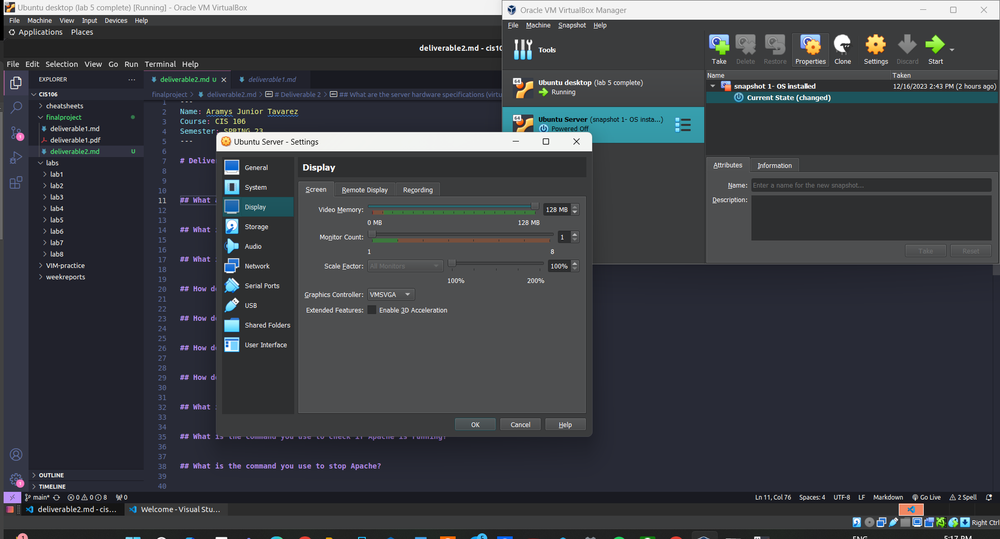

# Deliverable 2

## What are the server hardware specifications (virtual machine settings)? 

## What is Ubuntu server log in screen? 

## What is the IP address of your Ubuntu Server Virtual Machine?
In the welcome page, in the section ipv4 address:192.168.1.154

## How do you enable the Ubuntu Firewall?
`sudo afw enable`

## How do you check if the Ubuntu Firewall is running?
`sudo afw status`

## How do you disable the Ubuntu Firewall?
`sudo afw desable`

## How do you add Apache to the Firewall?
`sudo afw allow 'apache'`

## What is the command you used to install Apache?
`sudo apt install apache2`

## What is the command you use to check if Apache is running?
`sudo systemctl status apache2 --no-pager`

## What is the command you use to stop Apache?
`sudo systemctl stop apache2 --no-pager`

## What is the command you use to restart Apache?
`sudo systemctl restart apache2 --no-pager`

## What is the command used to test Apache configuration?
`sudo apachectl configtest`

## What is the command used to check the installed version of Apache?
`apache2 -v`

## What are the most common commands to troubleshoot Apache errors? Provide a brief description of each command.
`systemctl` - Used to control and interact with Linux services via the systemd service manager.
`journalctl` - Used to query and view the logs that are generated by systemd.
`apachectl` - When troubleshooting, this command is used to check Apache’s configuration.

## Which are Apache Log Files, and what are they used for?
Apache log files are a very helpful resource for troubleshooting. Generally, any error that you receive in a browser or other HTTP client will have a corresponding entry in Apache’s logs.
To examine log files for errors while troubleshooting Apache on a Fedora, CentOS, or RedHat server, examine the `/var/log/httpd/error_log` file.

