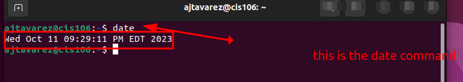
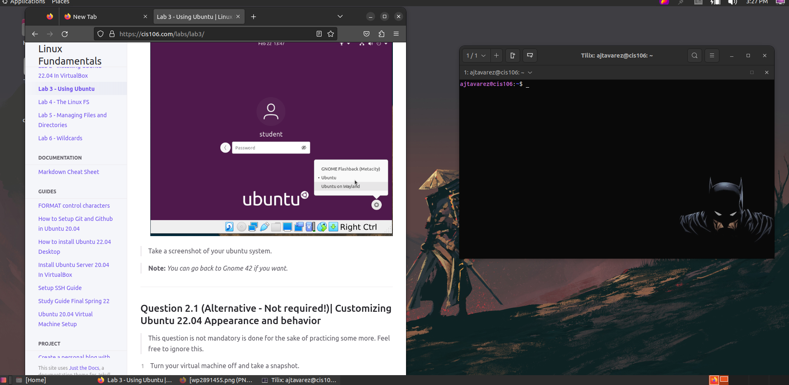

# Lab 3 submission

## Question 1

## Question 2

## Question 3

| Program purpose     | Package Name     | Version            |
| ------------------- | ---------------- | ------------------ |
| Play a tetris game  | blockattack      | 2.7.0-1            |
| Play a video file   | dragonplayer     | 4:21.12.3-0ubuntu1 |
| Browse the internet | epiphany-browser | 42.4-0ubuntu1      |
| Read your email     | geary            | 40.0-2             |
| Play music          | gmpc             | 11.8.16-19         |

## Question 4

| command | what it does                                                 |
| ------- | ------------------------------------------------------------ |
| echo    | lines of text or strings                                     |
| fortune | random epigrams                                              |
| cowsay  | cow saying something provided by the  user                   |
| lolcat  | applies rainbow color formatting to the text                 |
| figlet  | isplay large characters made up of ordinary screen character |
| toilet  | display large colourful characters                           |
| rig     | Random Identity Generator                                    |

