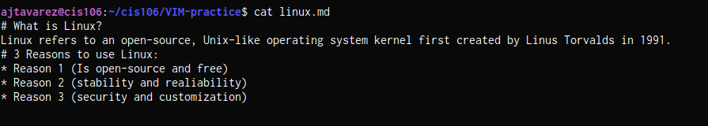
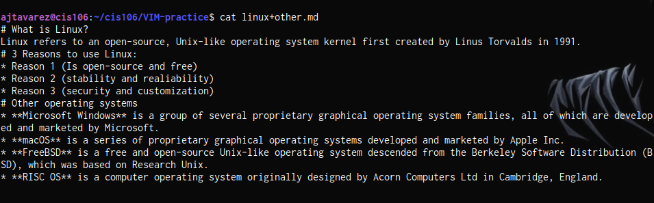
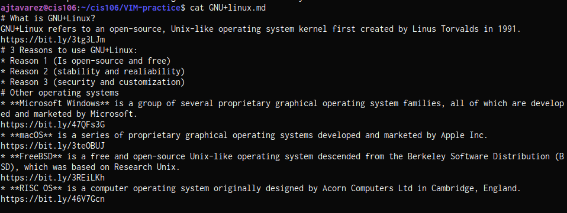

# Lab 7  

## VIM practice #1 

https://github.com/Aramys07/cis106/blob/main/VIM-practice/linux.md

## VIM practice #2

https://github.com/Aramys07/cis106/blob/main/VIM-practice/linux%2Bother.md

## VIM practice #3 

https://github.com/Aramys07/cis106/blob/main/VIM-practice/GNU%2Blinux.md

