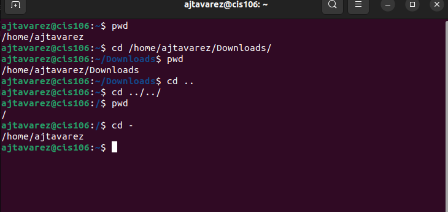
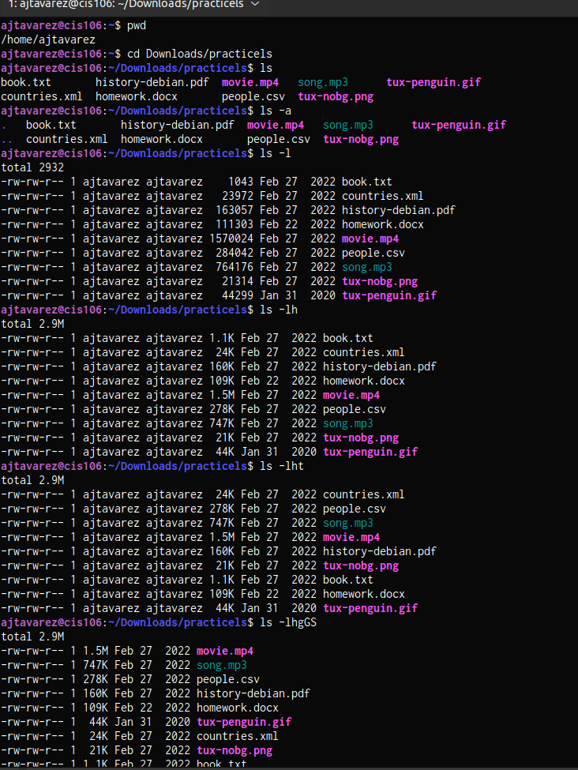
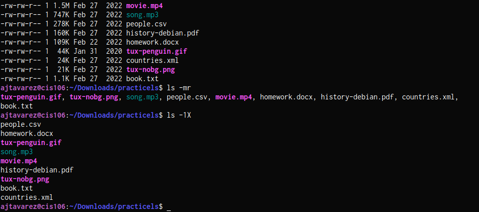
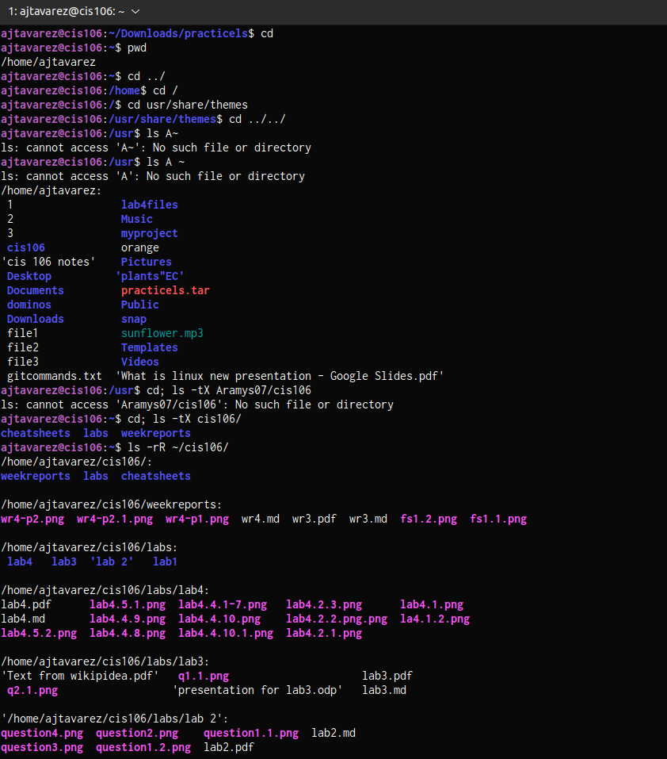
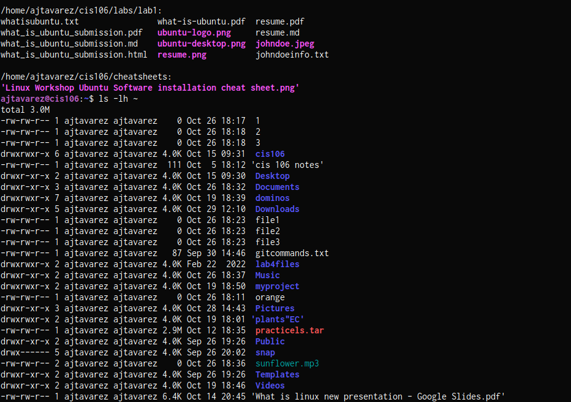
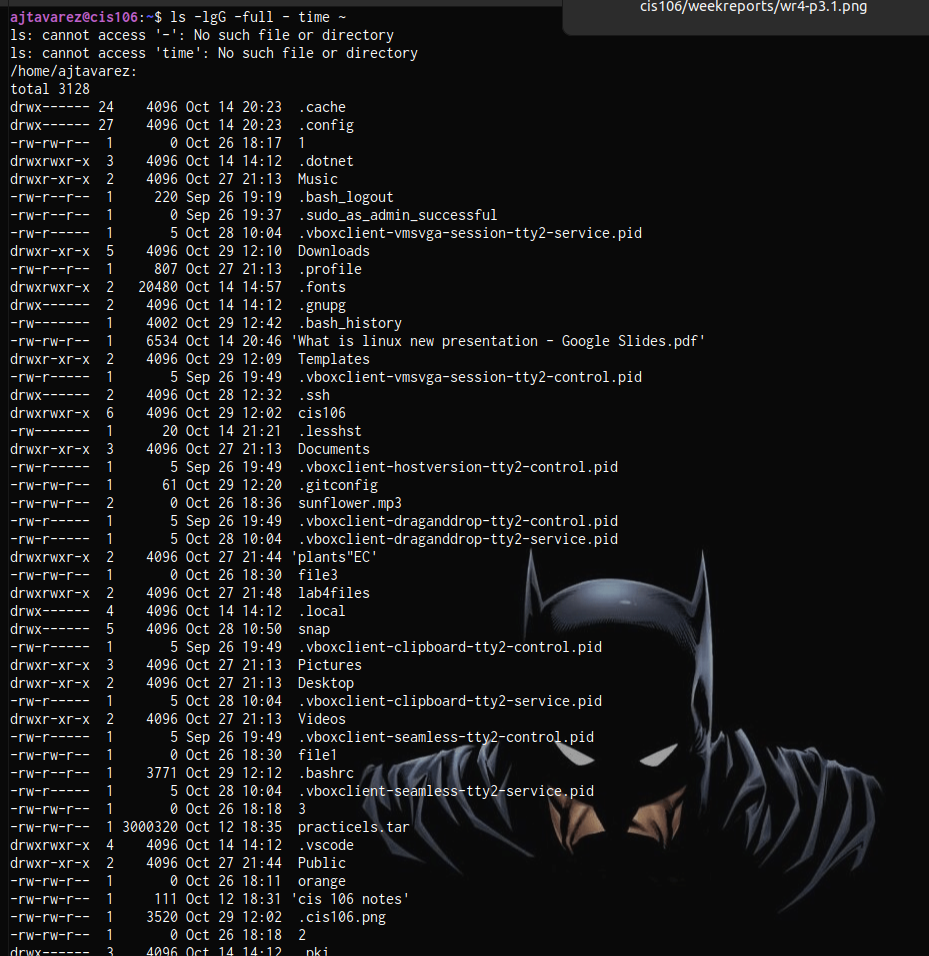
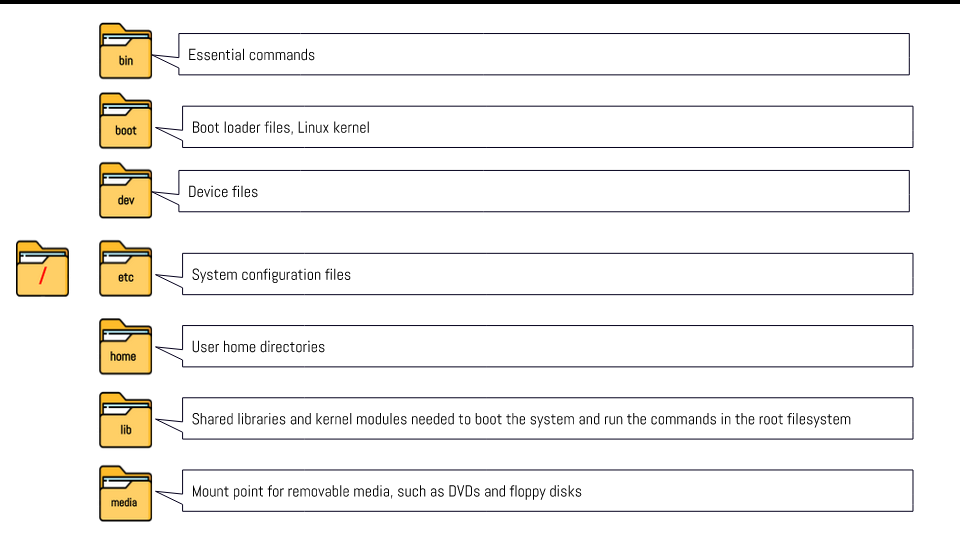
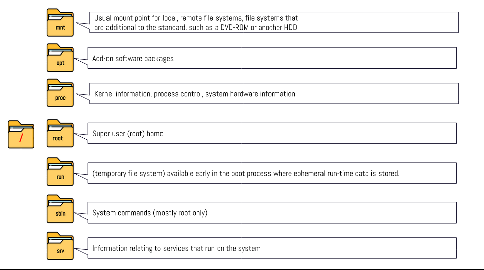

---

Name: Aramys Junior Tavarez
Course: CIS 106
Semester: SPRING 23

---

# Week Report 4

## Practice from the presentation The Linux File system:

### Practice 1
 

### Practice 2
 
 

### Practice 3
 
 
 

## The Linux File System directories and their purpose:
 
 

## All the commands for navigating the filesystem

| Command | What it does               | Syntax | Example |
| ------- | -------------------------- | ------ | ------- |
| pwd     | prints current directory   | pwd    | `pwd`   |
| cd      | change the shell directory | cd     | `cd`    |
| ls      | list files of directory    | ls     | `ls`    |

## Basic terminology 

*  **File system:** The way files are stored and organized.
*  **Current directory:** The directory where you are at the moment.
*  **parent directory:** where you always working inside of it.
*  **the difference between YOUR HOME directory and THE HOME directory:** Your home directory refers to the user's home directory. The home directory refers to the home directory located in the root.
*  **pathname:** Indicates the location of the file in the filesystem.
*  **relative path:** The location of a file starting from the current directory.
*  **absolute path:** Th location of a file starting a the root of the file system. 