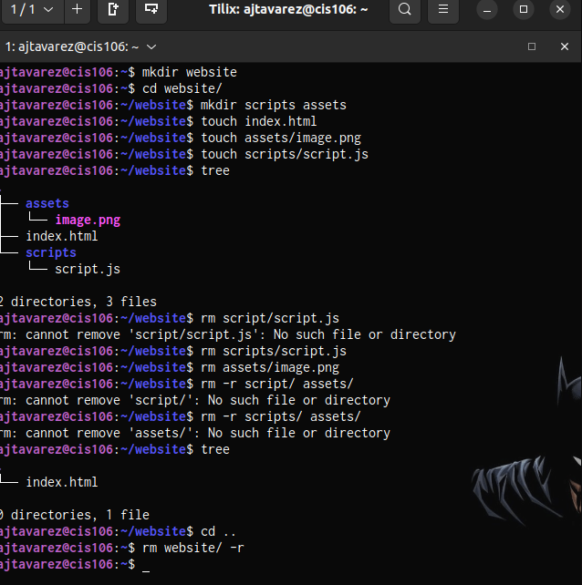
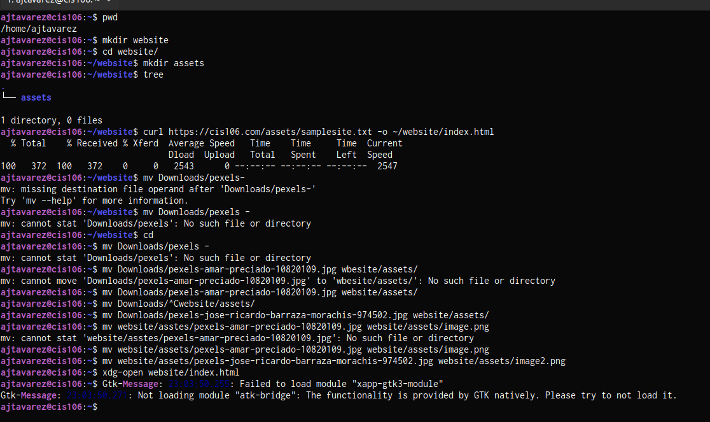
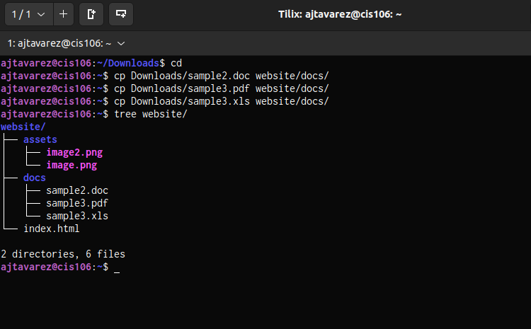

# Week Report 5

## Answers to questions:

* **What are Command Options?**
  Items that modify/enhance their behavior.
  
* **What are Command Arguments?**
  The items the commands acts on. This can be a file or directory.
  
* **Which command is used for creating directories? Provide at least 3 examples.**
 the command is `mkdir` 
 * example 1:
  * Create a directory: `mkdir potatoes`
 * example 2:
  * Create multiple directories : `mkdir movies ~/Downloads/games ~/Documents/hmw` 
 * example 3: 
  * Create a parent directory : `mkdir -p wallpapers_others/movies`

* **What does the touch command do? Provide at least 3 examples.**
  `touch` is used for creating files
  * example 1:
   * Create a file: `touch list`
  * example 2:
   * To create several times: `touch list_of_cars.txt script.py names.csv`
  * example 3:
   * To create a file with a space in its name: `touch "list of foods.txt"`  
  
* **How do you remove a file? Provide an example.**
  The command is `rm`
  * example 1:
   * Remove a file: `rm list` 
  
* **How do you remove a directory and can you remove non-empty directories in Linux? Provide an example**
  To remove a directory use `rm` with the -r option.
  To remove non-empty directories use `rm -r Downloads/games`

  
* **Explain the mv and cp command. Provide at least 2 examples of each**
  `mv` moves and renames directories.
  * example 1:
   * To move a file from a directory to another: `mv Downloads/homework.pdf Documents/`
   * To move multiple directories/files to another directory: `mv games/ wallpapers/ rockmusic/ /media/student/flashdrive/` 

## Practice 1
 

## Practice 2
 

## Practice 3
 

## Practice 4
 