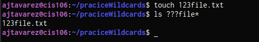
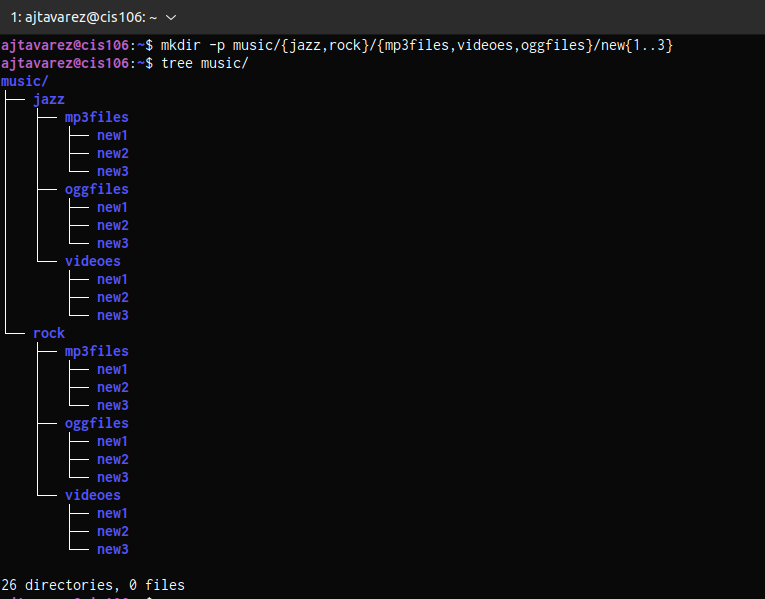
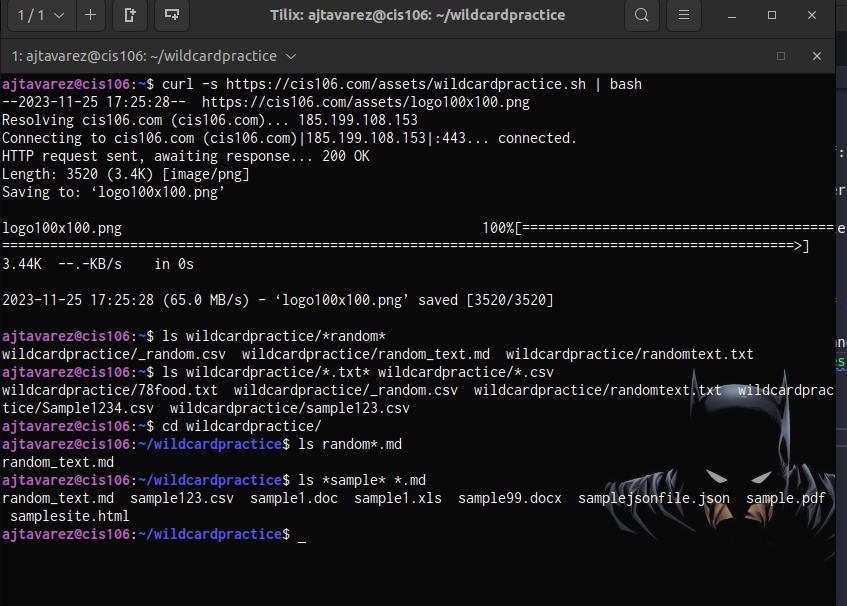
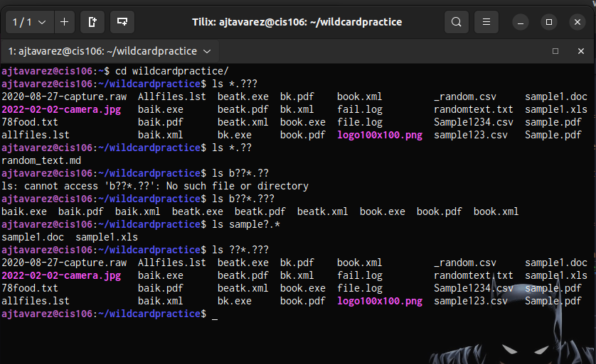
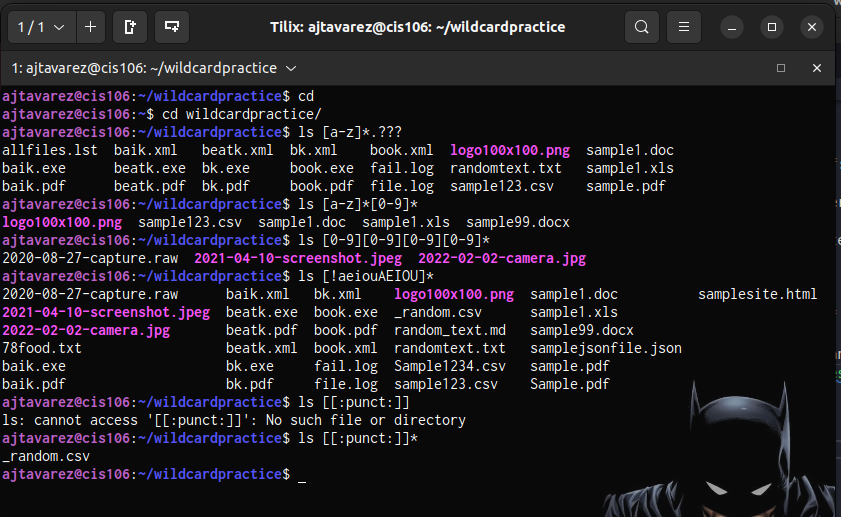

# Week Report 6

## Wildcards

### * Wildcard
The * wildcard matches from 0 to any number of characters. 
* Examples:        
  * List all the text file in a directory:
    * `ls * .txt`
  * List all the  files that start with the word file
    * `ls file*`
  * Copy all the mp4 files
    * `cp Downloads/*.mp4 ~/Videos/Movies/`
  
### ? Wildcard 
The ? wildcard metacharacter matches prcisely one character.
* Examples: 
  * list all the files that have 3 characters and are  followed by the word file in the name.

### [] Wildcard 
The brackets wildcard match a single character in a range.
* Examples:
  * To match all the files that have a vowel after letter f:
    * `ls f[aeiou]*` 
  * To match all files that do not have a vowel after letter f:
    * `ls f[!aeiou]*`
  * To match all the files that have a range of letters after f:
    * `ls f[a-z]*`

### Brace Expansion
Brace expansion {} is not a wildcard but another feature of bash that allows you to generate arbitrary strings to use with commands.
* Examples:
  * To create a whole directory structure in a single command:
    * `mkdir -p music/{jazz,rock}/{mp3files,videoes,oggfiles}/new{1..3}` 

## Practice 

